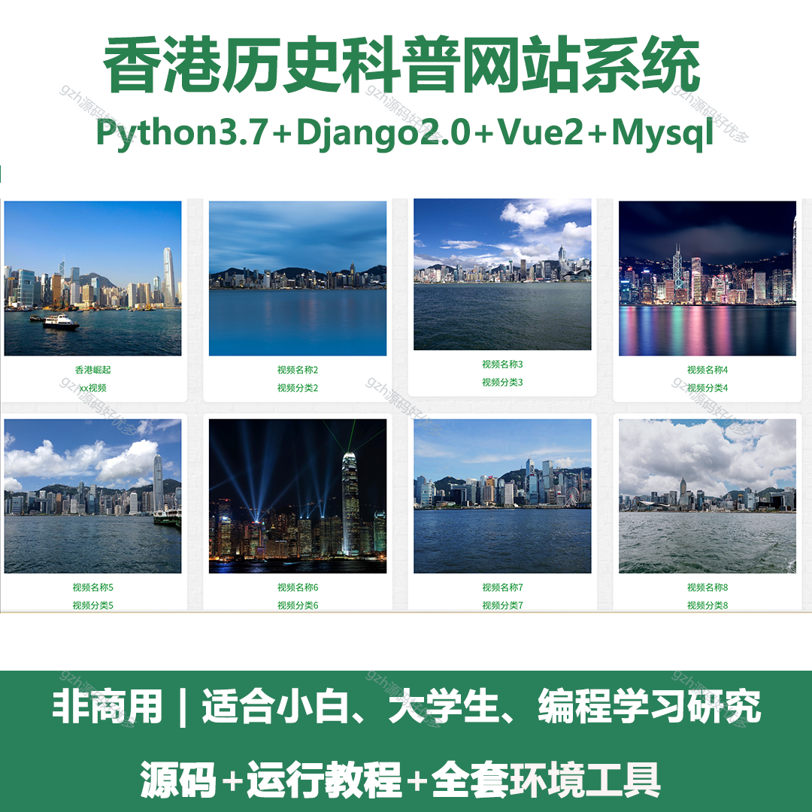
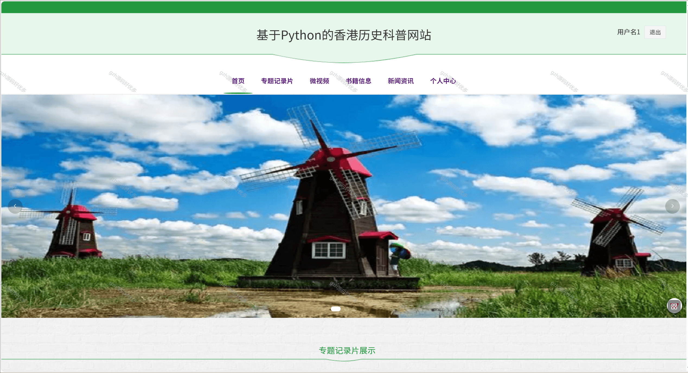
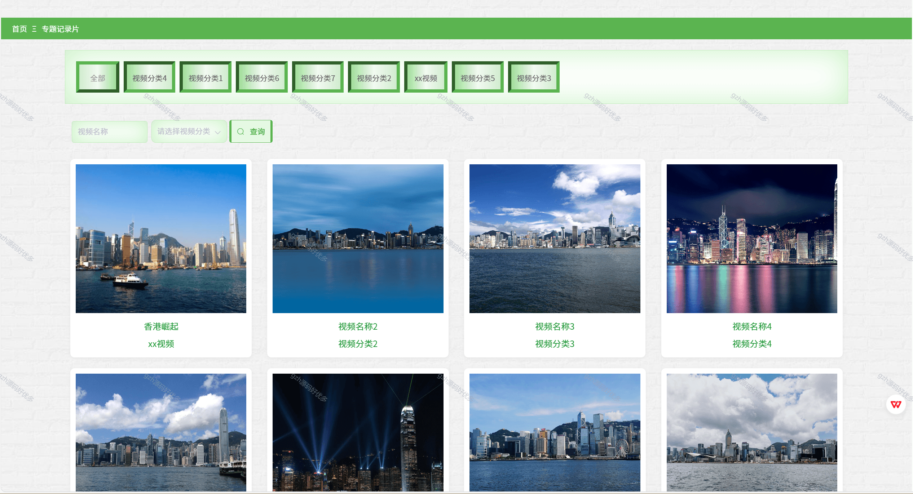
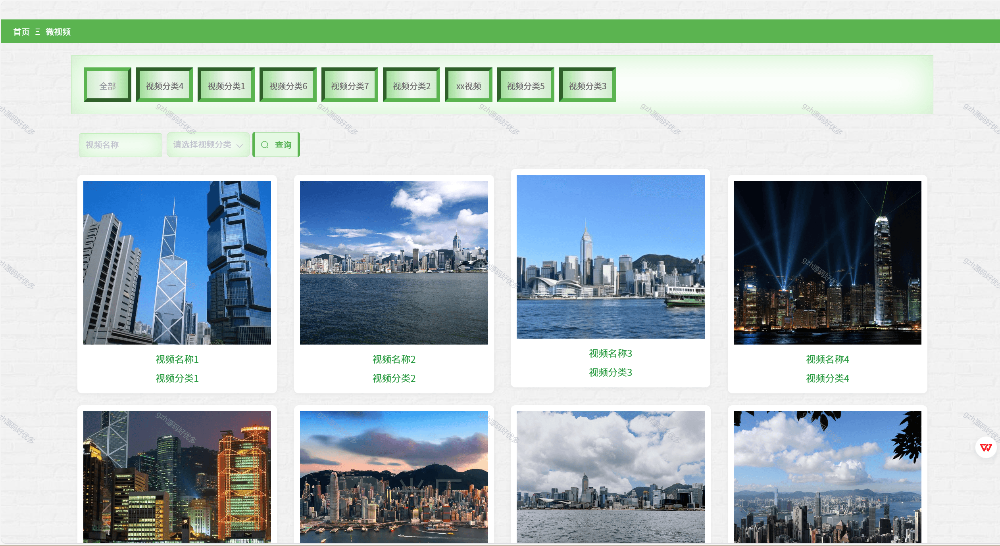
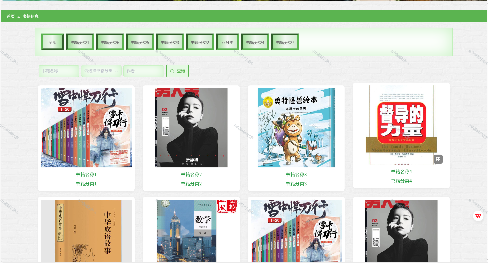
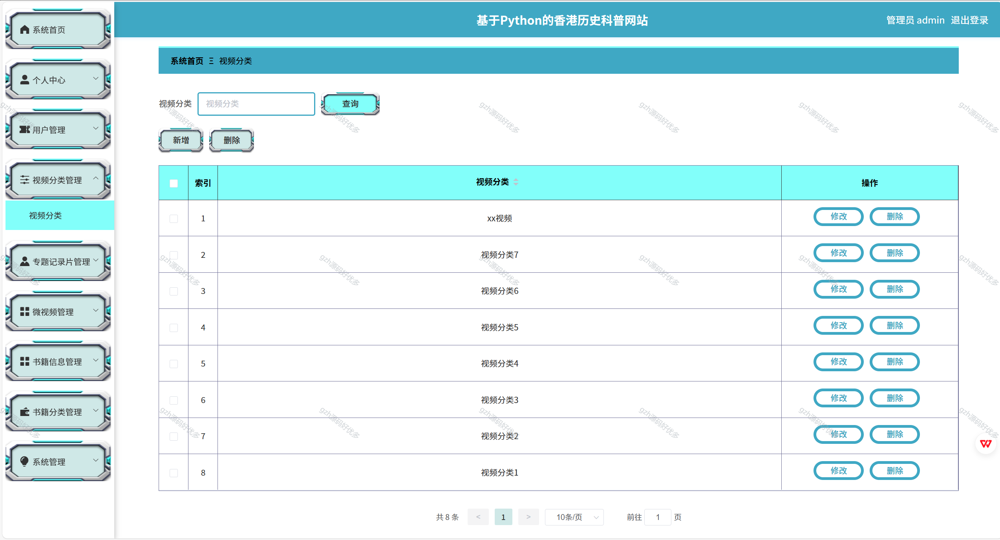
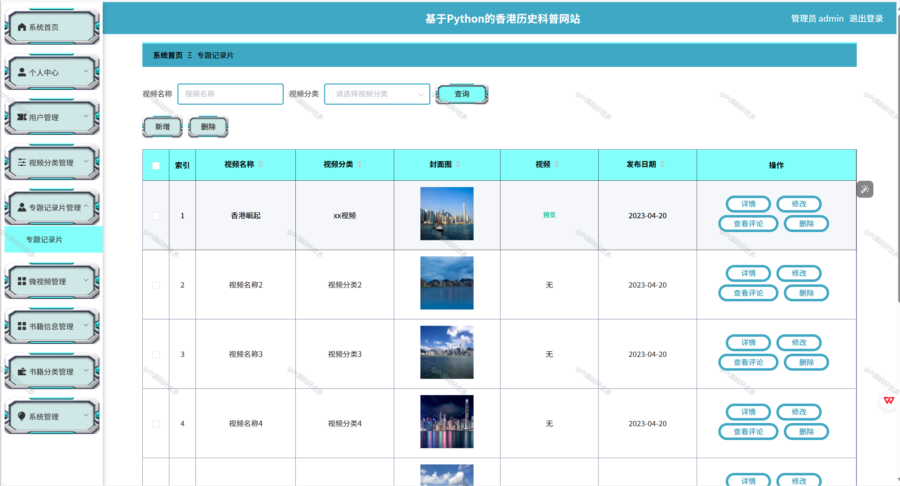
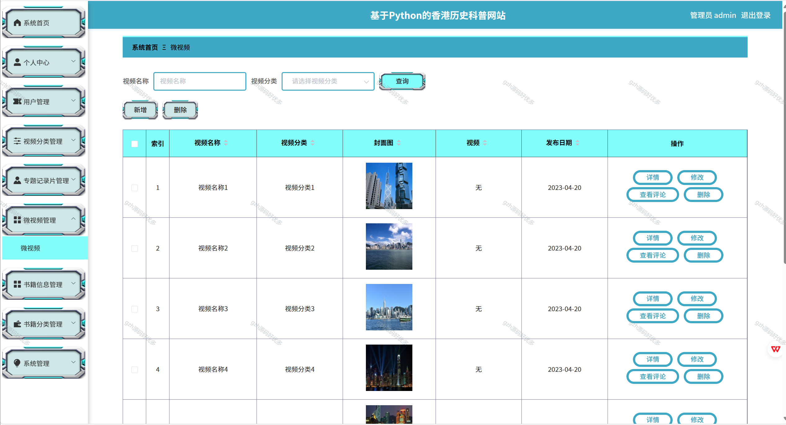
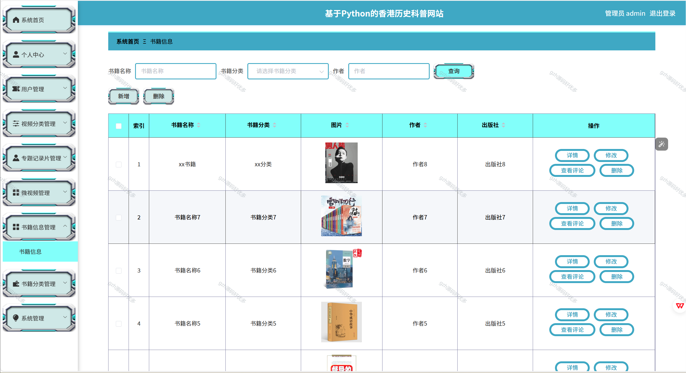

# python072
python072基于Python+Django的香港历史科普网站
 
## 查看主页获取源码

### 一、关键词
香港历史知识网站，香港历史教育网站，香港历史文化网站

### 二、作品包含
源码+数据库+全套环境和工具资源+本地部署教程

### 三、项目技术
前端技术：Vue2.0、Element-ui
后端技术：Python3.7、Django2.0

### 四、运行环境（以下版本亲测，其他版本兼容性请自行测试）
开发工具：PyCharm + VSCODE

数据库：MySQL5.7（最低要5.7版本）

数据库管理工具：Navicat10+

Python：Python3.7

前端Nodejs：14

浏览器：谷歌浏览器

### 五、项目介绍
项目编号：python072

香港历史科普网站可系统呈现香港历史脉络、解读重要事件与文化内涵，助力公众尤其是青少年全面、客观认知香港发展历程及与祖国的紧密联系。
香港历史科普网站系统，前端供用户浏览香港历史相关专题纪录片、微视频、书籍信息，进行个人中心操作；后端管理员可管理用户、视频分类、各类视频及书籍信息、系统设置 ，实现内容维护与用户管理。

### 六、运行截图

